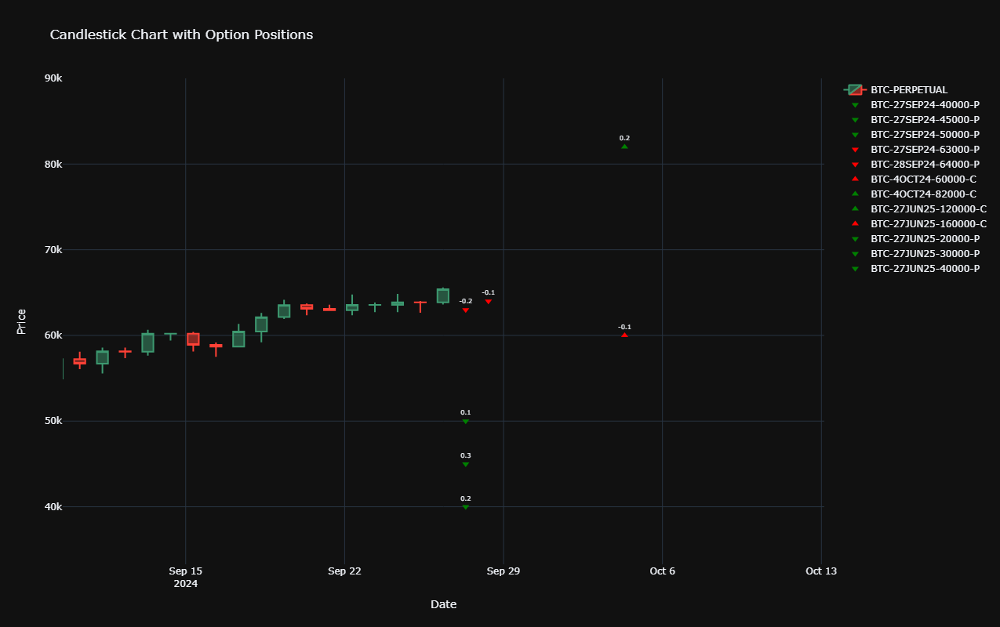

# Option Position Chart
Python code that plots option positions on a price chart of the underlying.

Dash Plotly is used as the frontend.

Arrow details:
- Down = put
- Up = call
- Green = long
- Red = short

## Setup

You will need to change the following line in api_functions.py

from settings_backup import *

to this:

from settings import *

Then add your own API key details. The provided API details are not real, but show what it should look like.

## Additional info

Go to https://github.com/cryptarbitrage-code/position-visualisation for the latest code.

Follow me on https://twitter.com/cryptarbitrage for other free resources and content.
